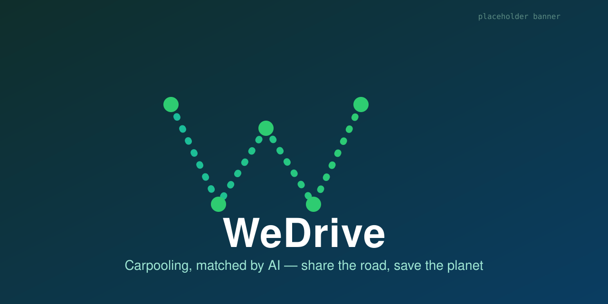

<div align="center">



# WeDrive — open-source carpooling / ride-sharing platform

A self-hostable **BlaBlaCar alternative** — PHP MVC + MySQL + AI ride-matching.
Drivers publish rides, passengers reserve seats, and an **AI ride-matching
engine** scores compatibility by detour and estimates the **CO₂ saved** by
sharing the trip. Own your data, pay no per-ride fees, run it on your own box.

[](https://github.com/aliammari1/WeDrive-Carpooling-app/actions/workflows/ci.yml)
[](LICENSE)


### ⭐ If a self-hostable BlaBlaCar alternative is useful to you, **[star the repo](https://github.com/aliammari1/WeDrive-Carpooling-app)** — it's the #1 way to help.

[**▶ Run it in 60s**](#-runs-in-60-seconds) · [Deploy to Railway](#live-demo--hosting) · [Docs](https://github.com/aliammari1/WeDrive-Carpooling-app#documentation) · [Why self-host?](#why-self-host-vs-blablacar)

</div>

> **TODO (banner + GIF):** `assets/banner.svg` is a placeholder and the
> ride-matching demo GIF (`assets/demo.gif`) is not captured yet. See
> [`BANNER.md`](BANNER.md) for the planned brandkit render, the GIF storyboard,
> and the GitHub social preview.

## Why WeDrive

- **Runs in 60 seconds** — one `docker compose up` boots the app **and** a seeded
  MySQL 8.4 database with demo users. No manual schema steps, no config to run.
- **AI ride-matching + CO₂ score** — ranks drivers for a passenger by how little
  detour each ride adds, and estimates emissions avoided. Uses the free
  OpenRouteService API, with an **offline fallback** so it works with no key.
- **Security-reviewed & hardened** — a login auth-bypass and two SQL-injection
  sinks were found and **fixed**; CSP + security headers, login/endpoint rate
  limiting, Sentry + JSON logging, plus PHPUnit, Infection mutation testing and
  Psalm taint analysis keep it that way.
- **Self-hostable & MIT-licensed** — fork it, run it, extend it. No SaaS lock-in.

## Why self-host (vs BlaBlaCar)

| | **WeDrive (self-hosted)** | BlaBlaCar / hosted SaaS |
|---|---|---|
| **Cost** | Free, MIT — only your hosting | Per-ride service fees |
| **Data ownership** | Your DB, your server | Held by the provider |
| **Customisation** | Full source, fork & extend | Closed platform |
| **AI ride-matching** | Built-in (detour + CO₂), BYO ORS key | N/A to operators |
| **Run anywhere** | `docker compose up`, any PHP host | Hosted only |
| **Branding** | White-label it | Their brand |
| **Privacy** | No third-party tracking by default | Provider's terms |

Best for communities, campuses, employers and co-ops that want their own
ride-sharing service without handing riders' data (or a cut of every trip) to a
third party.

## 🚀 Runs in 60 seconds

```bash
git clone https://github.com/aliammari1/WeDrive-Carpooling-app.git
cd WeDrive-Carpooling-app
cp .env.example .env          # optional: tweak DB / ORS_API_KEY
docker compose up --build     # app on http://localhost:8080
docker compose exec app php database/seed.php   # demo users
```

Then open <http://localhost:8080> and log in with a demo account below. That's
the whole setup — carpooling repos usually die from not running out-of-the-box,
so this one ships a Compose file with a pre-seeded schema on purpose.

**Demo credentials** (all password `password123`): `admin@wedrive.test`,
`driver@wedrive.test`, `rider@wedrive.test`.

See the [full getting-started guide](docs/getting-started.md) for the local-PHP
path (Composer + your own MySQL).

> **Demo GIF (planned):** a 10-second clip of a passenger searching, the AI
> ranking drivers by detour, and the CO₂-saved badge will live at
> `assets/demo.gif` — storyboard in [`BANNER.md`](BANNER.md).

## Live demo & hosting

[](https://railway.com/new)

PHP can't run on Cloudflare Workers/Pages (those host the docs only), so the app
needs a real PHP host. Because the repo already ships a `docker-compose.yml`, the
simplest free path is **[Railway](https://railway.com)** — its free trial grants
a one-time **$5 credit** and it accepts a Compose file directly:

1. Push this repo to GitHub, then **New Project → Deploy from GitHub repo** on
   Railway (or drag `docker-compose.yml` onto the project canvas — Railway
   imports each service as a separate Railway service).
2. Add a **managed MySQL** database: **+ New → Database → MySQL**. Railway exposes
   `MYSQL*` connection variables automatically.
3. Map them to WeDrive's env (`DB_HOST`, `DB_PORT`, `DB_NAME`, `DB_USER`,
   `DB_PASSWORD`) on the app service, plus an optional `ORS_API_KEY`.
4. Load the schema once: `railway run mysql < database/schema.sql` (or
   `railway shell` → `php database/seed.php` for demo data).

See [docs/deployment.md](docs/deployment.md) for the full walkthrough and other
free-tier options (Render, fly.io, InfinityFree) with their trade-offs. For a
zero-cost local run, `docker compose up` is still the fastest demo.

## Configuration (`.env.example`)

| Variable | Default | Purpose |
|---|---|---|
| `DB_HOST` / `DB_PORT` | `127.0.0.1` / `3306` | MySQL connection |
| `DB_NAME` | `wedrive` | single consolidated schema |
| `DB_USER` / `DB_PASSWORD` | `root` / _(empty)_ | credentials |
| `ORS_API_KEY` | _(empty)_ | OpenRouteService; blank => offline fallback |
| `GOOGLE_MAPS_API_KEY` | _(empty)_ | Google Maps JS key used by the View map widgets |

No credentials live in source — everything reads from `.env` (git-ignored) via
the single `WeDrive\Database::pdo()` factory.

### Front-end Google Maps key

The Google Maps JavaScript widgets in the `View/` layer read their key from
`Config/keys.php`, which is **git-ignored**. Set it up once:

```bash
cp Config/keys.example.php Config/keys.php   # then edit, or just export the env var
export GOOGLE_MAPS_API_KEY="your-real-key"   # preferred for prod / Docker
```

`Config/keys.php` resolves `getenv('GOOGLE_MAPS_API_KEY')` first and falls back
to a `CHANGE_ME` placeholder, so the app still loads during local setup. The
View files inject the value with `htmlspecialchars(...)` — no key is ever
hardcoded in source.

## Architecture

```
Controller/   request handlers (Users, Reservations, Reclamations, trajets, avis, Ai)
Model/        PDO data-access classes
View/         HTML pages + Argon/Bootstrap assets
src/          PSR-4 WeDrive\ namespace: Database, Bootstrap, Ai\ ride-matching,
              Http\ (security headers + rate limiter), Observability\ (Monolog/Sentry)
database/     schema.sql, seeds.sql, seed.php
tests/        PHPUnit (auth, SQL-injection, AI matching, rate limiter, headers)
```

The legacy hand-rolled MVC keeps working; new, type-safe, testable code lives in
`src/` (PSR-4, `composer dump-autoload`). Full diagram + ERD in the
[docs](docs/architecture.md).

## AI ride matching

```php
use WeDrive\Ai\GeoPoint;
use WeDrive\Ai\RideMatcher;

$matcher = RideMatcher::fromEnv();          // ORS if key set, else offline
$result  = $matcher->score($driverOrigin, $driverDest, $pickup, $dropoff);
// $result->score (0..100), ->detourKm, ->co2SavedKg, ->usedLiveRouting
```

HTTP: `Controller/Ai/matchRides.php?pickup=lat,lng&dropoff=lat,lng` returns a
JSON list of trajets ranked best-first. Details: [docs/ai-matching.md](docs/ai-matching.md).

## Screenshots

_TODO — add dashboard / ride-matching screenshots to `assets/` (see BANNER.md)._

## Security

A review found and fixed:

- **Auth bypass** — login accepted *any* password (the submitted password was
  hashed and "verified" against its own fresh hash). Now uses `password_verify()`
  against the stored bcrypt hash.
- **SQL injection** — `searchReservation` / `sortReservation` and an `avis` page
  were parameterized / whitelisted.

On top of the fixes, the app now ships defence-in-depth middleware
(`src/Http/`, `src/Observability/`):

- **CSP + security headers** (`SecurityHeaders`) — Content-Security-Policy
  (page + strict JSON variants), `X-Content-Type-Options`, `X-Frame-Options:
  DENY`, Referrer-Policy, Permissions-Policy, HSTS.
- **Rate limiting** (`RateLimiter`) — brute-force throttle on the login POST
  (5 / 5 min / IP) and the public `matchRides` JSON endpoint (30 / min / IP),
  with standard `X-RateLimit-*` / `Retry-After` headers.
- **Structured logging + error tracking** — Monolog JSON logs on stderr with a
  per-request correlation id, and optional Sentry (both no-op without config).

These are pinned by `tests/AuthTest.php`, `tests/ReservationInjectionTest.php`,
`tests/RateLimiterTest.php` and `tests/SecurityHeadersTest.php`, and guarded by
Psalm taint analysis + gitleaks + Infection mutation testing in CI. More:
[docs/security.md](docs/security.md). Report issues privately to
`ammari.ali.0001@gmail.com`.

## Testing & CI

```bash
composer install
vendor/bin/phpunit          # unit tests
vendor/bin/phpstan analyse  # static analysis (level 3)
vendor/bin/phpcs            # PSR-12
vendor/bin/infection        # mutation testing (Ai + Http logic, --min-msi 70)
```

CI runs a PHP 8.2/8.3 matrix: `php -l` lint → PHPStan → PHP_CodeSniffer →
PHPUnit (against a MySQL 8.4 service) → Codecov, plus an **Infection mutation
gate**, Psalm security analysis, gitleaks, and a SHA-pinned Trivy image scan.
All actions are SHA-pinned.

## Documentation

Full docs (getting started, deployment, architecture + ERD, AI ride-matching,
security) are built with MkDocs Material in [`docs/`](docs/) and published to
Cloudflare Pages. Start at [`docs/index.md`](docs/index.md).

## Engineering decisions

- **Single env-driven PDO** (`WeDrive\Database`) replaced 15+ hardcoded
  connections — this both removed secrets and made the models unit-testable
  (in-memory SQLite injected in tests).
- **One database name** (`wedrive`) replaced the inconsistent
  `covoiturage`/`projet` split; a reconstructed `schema.sql` makes it reproducible.
- **Psalm taint, not CodeQL** — CodeQL has no PHP support.
- **MySQL 8.4, not MariaDB 10.4** — the old devcontainer DB was EOL.
- **Cloudflare for docs only, Railway for the app** — Workers/Pages run JS/WASM,
  not PHP, so CF Pages hosts these docs while the app deploys to a PHP host. The
  repo ships `docker-compose.yml`, so a Compose-aware host (Railway) is one
  import away; see [docs/deployment.md](docs/deployment.md) for alternatives and
  their trade-offs.

## Contributing

Issues and PRs are welcome — see [CONTRIBUTING.md](CONTRIBUTING.md) for the dev
setup, the checks CI enforces, and the security conventions, and
[CODE_OF_CONDUCT.md](CODE_OF_CONDUCT.md). Now that WeDrive is MIT-licensed it is
eligible for [awesome-selfhosted](https://github.com/awesome-selfhosted/awesome-selfhosted)
(Mobility / Maps) — a submission is planned.

## License

[MIT](LICENSE) © 2023–2025 Ali Ammari. Bundled third-party assets
(Argon/Bootstrap theme — see [`View/LICENSE.md`](View/LICENSE.md) — FPDF,
PHPMailer) retain their own licenses.

---

## Related projects

Part of [@aliammari1](https://github.com/aliammari1)'s open-source portfolio:

- **[rakcha](https://github.com/aliammari1/rakcha)** — polyglot cinema platform
  (JavaFX + Symfony + Flutter).
- **[Hotline-Topup](https://github.com/aliammari1/Hotline-Topup)** — open-source
  telecom recharge / claims SaaS.
- **[JobPrep](https://github.com/aliammari1/JobPrep)** — open-source, BYOK AI
  interview-prep platform.
- **[github-traffic-analytics](https://github.com/aliammari1/github-traffic-analytics)**
  — self-hosted GitHub traffic analytics.

⭐ Found WeDrive useful? **[Star it](https://github.com/aliammari1/WeDrive-Carpooling-app)**
and check out [the rest of the portfolio](https://github.com/aliammari1).
