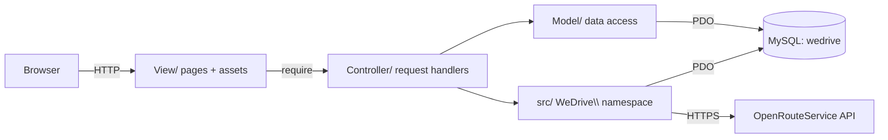

# Architecture

WeDrive is a hand-rolled **MVC** application. The legacy layers
(`Controller/`, `Model/`, `View/`) remain, and a modern **PSR-4 `src/`** layer
hosts the new, type-safe, testable code (the `WeDrive\` namespace).

## Layers

| Path | Role |
|---|---|
| `View/` | HTML pages, Argon/Bootstrap assets, inline page scripts |
| `Controller/` | Per-feature request handlers (Users, Reservations, Reclamations, trajets, avis, Ai) |
| `Model/` | Per-feature data-access classes (PDO) |
| `src/` | PSR-4 `WeDrive\` code: `Database` factory + `Ai\` ride-matching |
| `database/` | `schema.sql`, `seeds.sql`, `seed.php` |
| `tests/` | PHPUnit suite (auth, injection, AI) |

## Key engineering decisions

- **Single injectable connection.** `WeDrive\Database::pdo()` reads `DB_*` from
  `.env` (via vlucas/phpdotenv) and is the one place a `PDO` is created. The 15+
  previously-hardcoded `new PDO('mysql:...','root','')` calls were removed, which
  also made the models unit-testable (`Database::set()` injects an in-memory
  SQLite PDO in tests).
- **One database name.** The code mixed `covoiturage` and `projet`; everything
  now uses a single `wedrive` schema with a committed `schema.sql`.
- **Cross-platform requires.** Windows-only backslash `require` paths were
  normalized to forward slashes so the app runs on Linux (Docker/CI).
- **PHP SAST = Psalm taint analysis.** CodeQL does not support PHP, so security
  scanning uses Psalm's taint mode in CI.
