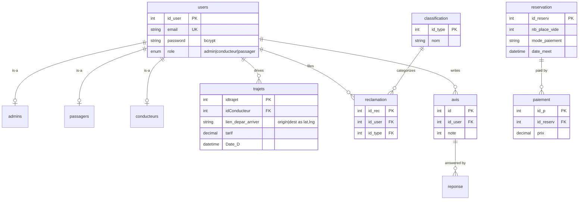

# Database Schema

The full DDL lives in [`database/schema.sql`](https://github.com/aliammari1/WeDrive-Carpooling-app/blob/main/database/schema.sql).
It was reconstructed from the data-access code (the repo historically shipped no
schema dump) and consolidated onto a single `wedrive` database.

## Tables

| Table | Purpose |
|---|---|
| `users` | accounts; `role` discriminates admin / conducteur / passager |
| `admins`, `passagers`, `conducteurs` | role-specific 1:1 extensions of `users` |
| `trajets` | published rides (origin/destination, price, date) |
| `address` | reusable departure/arrival address pairs |
| `reservation` | seat reservations |
| `paiement` | payments against a reservation |
| `reclamation` | support tickets |
| `classification` | reclamation categories / response templates |
| `avis` | reviews/ratings |
| `commentaires`, `reponse` | comments and replies |
